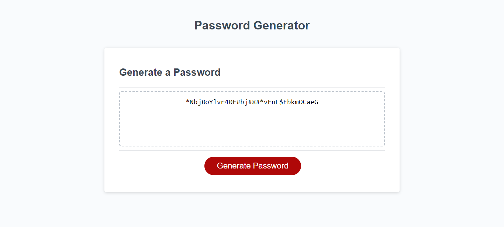

# mod3-challenge-JavaScript-password-generator
JavaScript Challenge: Password Generator

# <JavaScript Challenge: Password Generator>

## Description

The "JavaScript Challenge: Password Generator" required me to create an application that an employee can use to generate a random password based on criteria they've selected. This app can run in the browser, and features dynamically updated HTML and CSS powered by JavaScript code. It has a clean and polished user interface that is responsive and adapts to multiple screen sizes. 

## Technologies used:
- HTML
- CSS
- JavaScript

## Installation
1. Ensure you have a web browser installed on your computer (e.g, Google, Mozilla Firefox).
2. Clone this repository to your local machine using following command: git clone git@github.com:tigriego/mod2-challenge-professionalportfolio.git. Alternatively, you can download the repository as a ZIP file and extract it.

3. Open the project folder in your preferred code editor. 
4. Customize the password generator content.
5. Launch the page
6. Click on the 'generate password' button to start 

## Technical Perspective Usage

 the password generator works with the use of conditional statements, random number generation, and string manipulation to create the password based on the user's criteria.

## End User Usage

Below are the steps an end user can follow to use the random password generator:
- Open the webpage or application where the random password generator is available.
- Look for "Generate Password" button.
- Click on the "Generate Password" button.
- Multiple dialog boxes will appear, asking you to:
    - specify the desired length of the password. Enter a number between 10 and 128 to indicate the length of the password you want.
    - Do you want to include special characters?
    - Do you wan to include numeric characters?
    - Do you wan to include lowercase characters?
    - Do you want to include uppercase characters?

- Respond to each prompt by clicking "OK" or selecting the desired options to include those character types in the password. 
- Once you have made your selections, the random password generator will generate a password according to your specified criteria.
- The generated password will be displayed on the webpage or in a designated area, such as a text field or a notification box. Take note of the generated password or copy it to your clipboard for future use.
- If you are not satisfied with the generated password, you can repeat the process by clicking the "Generate Password" button again. This will generate a new password based on your updated criteria.

By following these steps, an end user can utilize the random password generator to obtain passwords that meet their desired length and criteria.

## Credits

The portfolio template and design were inspired by University of Texas Web Development Bootcamp Portfolio MockUp on Module 3: JavaScript Challenge: Password Generator.

The project uses the following open-source libraries, frameworks, or resources:
- Starter code from the bootcamp
- w3schools - JavaScript tutorials and exercises.   

## License

MIT License

## Screenshots/Demo 

- Live Demo: https://tigriego.github.io/mod3-challenge-JavaScript-password-generator/

- Screenshot of site: 

---